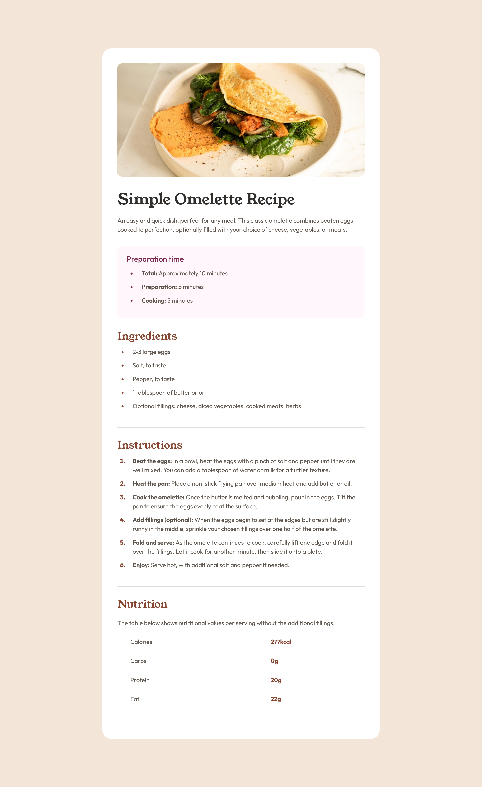

# Frontend Mentor - Recipe page solution

This is a solution to the [Recipe page challenge on Frontend Mentor](https://www.frontendmentor.io/challenges/recipe-page-KiTsR8QQKm). Frontend Mentor challenges help you improve your coding skills by building realistic projects.

## Table of contents

-   [Overview](#overview)
    -   [The challenge](#the-challenge)
    -   [Screenshot](#screenshot)
    -   [Links](#links)
-   [My process](#my-process)
    -   [Built with](#built-with)
    -   [Useful resources](#useful-resources)
-   [Author](#author)

## Overview

### Screenshot

### Links

-   Solution URL: [Link](https://olaide-hok.github.io/recipe-page/)

### Built with

-   Semantic HTML5 markup
-   CSS custom properties
-   Flexbox
-   CSS Grid
-   Mobile-first workflow

### Useful resources

-   [Styling lists](https://developer.mozilla.org/en-US/docs/Learn_web_development/Core/Text_styling/Styling_lists) - This helped me in styling list markers.
-   [Styling tables](https://developer.mozilla.org/en-US/docs/Learn_web_development/Core/Styling_basics/Tables) - This is an amazing resource to learn about styling html tables.

## Author

-   Website - [Habeeb Kareem](https://habeeb-dev.netlify.app)
-   Frontend Mentor - [@olaide-hok](https://www.frontendmentor.io/profile/olaide-hok)
